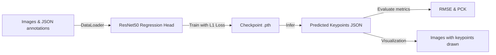

# 🎾 Tennis Court Keypoint Detection

This repository contains a **PyTorch** codebase to detect **tennis court keypoints** (e.g. lines, net center) using a **ResNet50 + regression head** model.

The goal is to train a model that predicts the coordinates of keypoints from input images and evaluate using metrics such as **RMSE** and **PCK** (Percentage of Correct Keypoints) following the specification in `Court-Detection-Docs.docx`.

---

## 📂 Repository Structure

```
court-keypoints/
├── README.md                 # This document
├── requirements.txt          # Dependencies
├── setup.sh                  # Create venv & install dependencies
├── configs/
│   └── tennis_resnet50.yaml  # Dataset/model/training configuration
├── data/                     # Images & annotations (NOT committed)
│   ├── train_images/
│   ├── valid_images/
│   ├── test_images/
│   └── annotations/
│       ├── train.json
│       ├── valid.json
│       └── test.json
├── outputs/                  # predicted.json & visualized images
├── checkpoints/              # saved model checkpoints (.pth)
├── logs/                     # TensorBoard logs
├── notebooks/
│   └── resnet50-for-tennis.ipynb  # Original notebook
├── run.py                    # CLI entrypoint (train/infer/eval)
├── src/                      # Main code
│   ├── __init__.py
│   ├── data.py               # Dataset + DataLoader
│   ├── augmentations.py      # Albumentations transforms
│   ├── model.py              # ResNet50 backbone
│   ├── losses.py             # Loss functions
│   ├── metrics.py            # RMSE, PCK
│   ├── train.py              # Training loop
│   ├── infer.py              # Inference loop
│   └── utils.py              # Seed, I/O json, visualization
└── scripts/
    └── evaluate.py           # Evaluate predicted.json vs groundtruth
```

---

## ⚙️ How It Works

- **Dataset**: Tennis court images plus JSON annotations (COCO-style or a list with `{'file_name','keypoints'}`).
- **Model**: `src/model.py` uses a pretrained ResNet50; the final fully-connected layer is replaced with a linear layer (2048 → 2*K) to regress (x,y) coordinates of K keypoints.
- **Loss**: `src/losses.py` implements Masked L1 loss, computing loss only on visible keypoints if a visibility flag exists.
- **Augmentation**: Albumentations (flip, rotate, brightness) in `src/augmentations.py`.
- **Training**: `src/train.py` implements the loop using AdamW optimizer, CosineAnnealing scheduler, and mixed precision.
- **Inference**: `src/infer.py` loads a checkpoint, predicts keypoints on the test set, rescales them back to original image size, saves `outputs/predicted.json` and visualizations.
- **Evaluation**: `scripts/evaluate.py` computes RMSE and PCK between `predicted.json` and ground truth JSON.

---

## 🧩 Pipeline (Train → Infer → Evaluate)



1. **Prepare data**: place images in `data/train_images/`, `data/valid_images/`, `data/test_images/` and corresponding JSON annotations in `data/annotations/`.
2. **Train**: 
   ```bash
   python run.py --mode train --config configs/tennis_resnet50.yaml
   ```
   → checkpoints saved in `checkpoints/`.
3. **Infer**:
   ```bash
   python run.py --mode infer --config configs/tennis_resnet50.yaml --checkpoint checkpoints/best_ckpt.pth
   ```
   → results in `outputs/predicted.json` and visualization images `outputs/vis_*.jpg`.
4. **Evaluate**:
   ```bash
   python run.py --mode eval --config configs/tennis_resnet50.yaml --pred outputs/predicted.json --gt data/annotations/test.json
   ```
   → prints RMSE & PCK on the console.

---

## 📑 Included Documents

- **Court-Detection-Docs.docx**: Specification of dataset format and metrics (OKS/PCK).
- **notebooks/resnet50-for-tennis.ipynb**: Original notebook before modularization.

---

## 🚀 Quick Setup

```bash
# 1. Clone repo
git clone https://github.com/yourname/court-keypoints.git
cd court-keypoints

# 2. Create venv & install dependencies
bash setup.sh  # or pip install -r requirements.txt

# 3. Train/infer/eval
python run.py --mode train --config configs/tennis_resnet50.yaml
```

---

## 📝 Notes
- Do not commit large images or checkpoints to GitHub (already in .gitignore).
- All parameters (epochs, lr, batch_size…) are set in `configs/tennis_resnet50.yaml`.
- Keypoint visualizations are automatically saved in `outputs/`.
